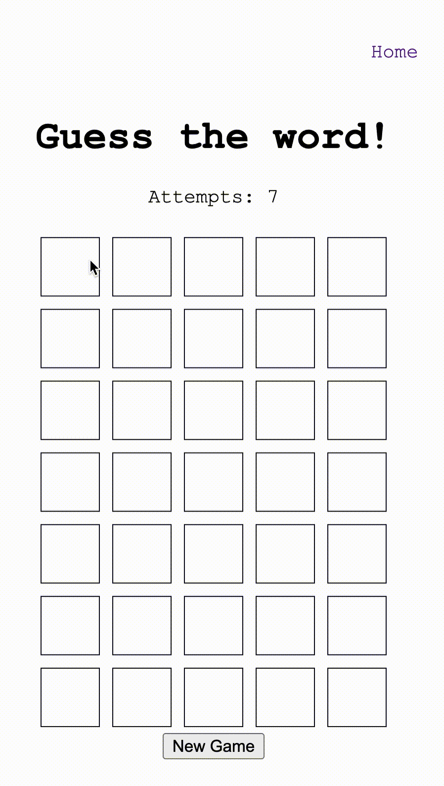

# Wordle 
## A Simple Word Game built using React and Redux

The words used in this game were adopted from Matt Reagan's Webster English Dictionary collection. [GitHub](https://github.com/matthewreagan/WebstersEnglishDictionary). 

## Mode
There are three difficulty levels for this game, 
- Easy (5 letters, 7 attempts)
- Medium (6 letters, 6 attempts)
- Hard (7 letters, 5 attempts)

## Demo

### Technology
Notification component [React-Notification-Component](https://teodosii.github.io/react-notifications-component/)

State management [Redux](https://github.com/reduxjs/redux)

### Installation 
1. run `git clone https://github.com/Eyoel-Wendwosen/wordle.git` to clone the repository.
2. cd into the director `cd wordle/`.
3. run `npm install` to install the node dependencies.
4. run `npm run dev` to run the program on your local machine. 